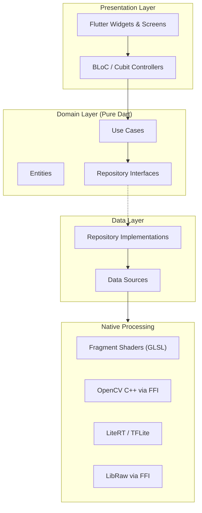

# 🌱 SeedColor — Lightroom Mobile Clone

**SeedColor by DevSeed Studio** — Aplikasi koreksi warna dan color grading profesional berbasis Flutter.

---

## Background & Problem

Kamu ingin membangun aplikasi mirip **Adobe Lightroom Mobile** dengan fitur lengkap untuk **Android**. Proyek ini sangat besar, jadi kita akan menggunakan pendekatan **phased development** — dimulai dari MVP yang sudah terlihat profesional, lalu bertahap ke fitur-fitur advanced dan AI.

### Keputusan yang Sudah Diambil

| Keputusan | Jawaban |
|:----------|:--------|
| **Platform** | Android only (iOS nanti jika ada pengembangan) |
| **Bahasa UI** | Bahasa Indonesia |
| **Monetisasi** | Gratis — untuk kebutuhan pribadi |
| **Cloud Sync** | Tidak untuk saat ini |
| **Preset Format** | Kompatibel dengan `.xmp` Lightroom |
| **Flutter SDK** | Terbaru (3.38+ / Dart 3.10+) |

---

## Status: ✅ APPROVED — Siap Dikerjakan

---

## Technology Stack

| Layer | Technology | Alasan |
|:------|:-----------|:-------|
| **Framework** | Flutter 3.38+ / Dart 3.10+ | Cross-platform, Impeller engine untuk smooth rendering |
| **State Management** | `flutter_bloc` + `replay_bloc` | Undo/redo built-in, clear separation of concerns |
| **Image Processing (Preview)** | Flutter Fragment Shaders (GLSL) | Real-time 60fps preview tanpa CPU overhead |
| **Image Processing (Export)** | `opencv_dart` v2.x via Dart FFI | Full-resolution processing, LUT engine, batch |
| **AI/ML** | `flutter_litert` (TFLite successor) | On-device inference untuk masking & segmentation |
| **AI Segmentation** | Google ML Kit Subject Segmentation | Subject/sky/people detection |
| **RAW Processing** | `flutter_libraw` + Dart FFI | DNG, CR2, NEF, ARW support |
| **Database** | `sqflite` / `drift` | Album, metadata, ratings, keywords |
| **Local Storage** | `path_provider` + file system | Image cache, thumbnails, edit history |
| **DI** | `get_it` + `injectable` | Dependency injection |
| **Routing** | `go_router` | Declarative routing |
| **UI Utilities** | `flutter_screenutil`, Google Fonts | Responsive design |

---

## Architecture Overview



---

## Proposed Changes

Semua file akan dibuat di: `d:\DevSeed Studio\Aplikasi koreksi warna\`

---

### Phase 1: Project Foundation & Core Setup

#### [NEW] Project Initialization

```
flutter create --org com.devseedstudio --project-name seed_color ./
```

#### [NEW] Project Structure

```text
lib/
├── app/
│   ├── app.dart                          # MaterialApp, theme, routing
│   ├── routes.dart                       # GoRouter configuration
│   ├── theme/
│   │   ├── app_theme.dart                # Dark/light theme data
│   │   ├── app_colors.dart               # Color palette constants
│   │   └── app_typography.dart           # Text styles (Google Fonts)
│   └── di/
│       └── injection.dart                # GetIt setup
│
├── core/
│   ├── constants/
│   │   ├── app_constants.dart            # Global constants
│   │   └── image_constants.dart          # Max sizes, formats, etc.
│   ├── extensions/
│   │   ├── image_extensions.dart         # Extension methods for images
│   │   └── color_extensions.dart         # HSL/RGB conversion helpers
│   ├── utils/
│   │   ├── image_utils.dart              # Thumbnail generation, format detection
│   │   ├── math_utils.dart               # Spline interpolation, curve math
│   │   └── debounce_utils.dart           # Slider debouncing
│   ├── errors/
│   │   └── failures.dart                 # Custom failure classes
│   └── widgets/
│       ├── seed_slider.dart              # Custom styled slider
│       ├── seed_button.dart              # Custom buttons
│       ├── seed_bottom_sheet.dart         # Bottom sheet pattern
│       └── loading_overlay.dart          # Loading indicator
│
├── features/
│   ├── library/                          # Photo library & albums
│   │   ├── data/
│   │   │   ├── datasources/
│   │   │   │   ├── photo_local_datasource.dart
│   │   │   │   └── album_local_datasource.dart
│   │   │   ├── models/
│   │   │   │   ├── photo_model.dart
│   │   │   │   └── album_model.dart
│   │   │   └── repositories/
│   │   │       └── library_repository_impl.dart
│   │   ├── domain/
│   │   │   ├── entities/
│   │   │   │   ├── photo.dart
│   │   │   │   └── album.dart
│   │   │   ├── repositories/
│   │   │   │   └── library_repository.dart
│   │   │   └── usecases/
│   │   │       ├── import_photos.dart
│   │   │       ├── get_albums.dart
│   │   │       └── manage_ratings.dart
│   │   └── presentation/
│   │       ├── bloc/
│   │       │   ├── library_bloc.dart
│   │       │   ├── library_event.dart
│   │       │   └── library_state.dart
│   │       ├── pages/
│   │       │   ├── library_page.dart
│   │       │   └── album_detail_page.dart
│   │       └── widgets/
│   │           ├── photo_grid.dart
│   │           ├── photo_thumbnail.dart
│   │           └── album_card.dart
│   │
│   ├── editor/                           # Main editor (core feature)
│   │   ├── data/
│   │   │   ├── datasources/
│   │   │   │   ├── shader_datasource.dart    # GLSL shader loading
│   │   │   │   └── opencv_datasource.dart    # OpenCV FFI bridge
│   │   │   ├── models/
│   │   │   │   ├── edit_parameters_model.dart
│   │   │   │   └── curve_points_model.dart
│   │   │   └── repositories/
│   │   │       └── editor_repository_impl.dart
│   │   ├── domain/
│   │   │   ├── entities/
│   │   │   │   ├── edit_session.dart          # Current editing session
│   │   │   │   ├── edit_parameters.dart       # All adjustment values
│   │   │   │   ├── curve_data.dart            # Curve control points
│   │   │   │   └── hsl_adjustments.dart       # HSL per-color adjustments
│   │   │   ├── repositories/
│   │   │   │   └── editor_repository.dart
│   │   │   └── usecases/
│   │   │       ├── apply_adjustments.dart
│   │   │       ├── apply_curves.dart
│   │   │       ├── apply_hsl.dart
│   │   │       ├── export_image.dart
│   │   │       └── reset_adjustments.dart
│   │   └── presentation/
│   │       ├── bloc/
│   │       │   ├── editor_bloc.dart           # ReplayBloc for undo/redo
│   │       │   ├── editor_event.dart
│   │       │   └── editor_state.dart
│   │       ├── pages/
│   │       │   └── editor_page.dart           # Main editor screen
│   │       └── widgets/
│   │           ├── image_canvas.dart          # CustomPainter + shader
│   │           ├── adjustment_panel.dart      # Bottom panel container
│   │           ├── tool_selector.dart         # Tool bar (Light, Color, etc.)
│   │           │
│   │           ├── panels/                    # Individual tool panels
│   │           │   ├── light_panel.dart        # Exposure, Contrast, etc.
│   │           │   ├── color_panel.dart        # Temp, Tint, Vibrance, Sat
│   │           │   ├── hsl_panel.dart          # Color Mixer (HSL)
│   │           │   ├── color_grading_panel.dart # Shadow/Mid/Highlight color
│   │           │   ├── effects_panel.dart      # Texture, Clarity, Dehaze
│   │           │   ├── detail_panel.dart       # Sharpening, Noise Reduction
│   │           │   ├── curves_panel.dart       # Interactive curves editor
│   │           │   ├── geometry_panel.dart     # Crop, Rotate, Perspective
│   │           │   └── optics_panel.dart       # Chromatic Ab., Lens Corr.
│   │           │
│   │           ├── curves/                    # Curves sub-widgets
│   │           │   ├── curve_painter.dart      # Custom curve drawing
│   │           │   └── curve_control_point.dart # Draggable point
│   │           │
│   │           └── crop/                      # Crop tool sub-widgets
│   │               ├── crop_overlay.dart
│   │               └── crop_handles.dart
│   │
│   ├── presets/                          # Preset management
│   │   ├── data/
│   │   │   ├── models/
│   │   │   │   └── preset_model.dart
│   │   │   └── repositories/
│   │   │       └── preset_repository_impl.dart
│   │   ├── domain/
│   │   │   ├── entities/
│   │   │   │   └── preset.dart
│   │   │   ├── repositories/
│   │   │   │   └── preset_repository.dart
│   │   │   └── usecases/
│   │   │       ├── save_preset.dart
│   │   │       ├── apply_preset.dart
│   │   │       └── import_export_preset.dart
│   │   └── presentation/
│   │       ├── bloc/
│   │       │   └── preset_bloc.dart
│   │       ├── pages/
│   │       │   └── preset_browser_page.dart
│   │       └── widgets/
│   │           ├── preset_card.dart
│   │           └── preset_preview.dart
│   │
│   └── export/                           # Export & sharing
│       ├── domain/
│       │   └── usecases/
│       │       ├── export_jpeg.dart
│       │       ├── export_png.dart
│       │       └── share_image.dart
│       └── presentation/
│           └── widgets/
│               └── export_dialog.dart
│
├── shaders/                              # GLSL Fragment Shaders
│   ├── adjustments.frag                  # Light adjustments shader
│   ├── color_adjustments.frag            # Color/HSL shader
│   ├── curves.frag                       # Curves shader
│   ├── effects.frag                      # Texture, Clarity, Dehaze
│   ├── color_grading.frag                # Color grading shader
│   └── composite.frag                    # Final composition shader
│
└── main.dart                             # Entry point
```

---

### Phase 1: MVP Core — Light, Color, HSL, Curves, Presets, Crop (3-4 bulan)

Ini adalah fase yang akan kita bangun **terlebih dahulu**. Setelah fase ini selesai, aplikasi sudah bisa digunakan dan terlihat profesional.

---

#### 1.1 App Shell & Design System

##### [NEW] `lib/app/theme/app_colors.dart`
- Definisi color palette SeedColor — dark mode primary
- Warna brand: seed green (#2ECC71 family), dark backgrounds (#0D1117, #161B22)
- Accent colors untuk tools (Light=kuning, Color=biru, HSL=rainbow gradient)

##### [NEW] `lib/app/theme/app_theme.dart`  
- ThemeData dark mode premium
- Google Fonts: **Inter** untuk body, **Outfit** untuk headings
- Custom slider themes, bottom sheet themes

##### [NEW] `lib/app/theme/app_typography.dart`
- Text styles hierarchy yang konsisten

##### [NEW] `lib/app/app.dart`
- MaterialApp.router setup dengan GoRouter
- Theme provider
- BlocProvider multi-provider setup

##### [NEW] `lib/app/routes.dart`
- Routes: `/` → Library, `/editor/:id` → Editor, `/presets` → Preset browser

##### [NEW] `lib/app/di/injection.dart`
- GetIt service locator registration

---

#### 1.2 Core Widgets & Utilities

##### [NEW] `lib/core/widgets/seed_slider.dart`
- Custom slider mirip Lightroom: centered indicator, gradient track
- Value label overlay saat drag
- Smooth haptic feedback

##### [NEW] `lib/core/widgets/seed_button.dart`
- Icon buttons dengan animated state

##### [NEW] `lib/core/utils/math_utils.dart`
- Catmull-Rom spline interpolation (untuk Curves)
- Cubic Bezier interpolation
- Linear interpolation helpers

##### [NEW] `lib/core/utils/debounce_utils.dart`
- Debouncer class untuk slider changes (16ms debounce = 60fps)

##### [NEW] `lib/core/extensions/color_extensions.dart`
- RGB ↔ HSL konversi
- Color temperature ↔ RGB
- Tint calculation

---

#### 1.3 Fragment Shaders (Real-time Preview Engine)

> [!NOTE]
> Shader ditulis dalam GLSL dan di-compile AOT oleh Impeller. Semua adjustment diapply di GPU sehingga preview tetap 60fps bahkan di mid-range device.

##### [NEW] `lib/shaders/adjustments.frag`
```glsl
// Input uniforms:
// - exposure (-5.0 to +5.0)
// - contrast (-100 to +100)  
// - highlights (-100 to +100)
// - shadows (-100 to +100)
// - whites (-100 to +100)
// - blacks (-100 to +100)
// Applies tone curve adjustment per-pixel
```

##### [NEW] `lib/shaders/color_adjustments.frag`
```glsl
// Input uniforms:
// - temperature (-100 to +100)
// - tint (-100 to +100)
// - vibrance (-100 to +100)
// - saturation (-100 to +100)
// RGB → HSL → adjust → HSL → RGB pipeline
```

##### [NEW] `lib/shaders/curves.frag`
```glsl
// Input: 256-entry LUT texture per channel (R, G, B, RGB)
// Lookup table based curve application
```

##### [NEW] `lib/shaders/effects.frag`
```glsl
// - texture (local contrast enhancement)
// - clarity (midtone contrast)
// - dehaze (atmospheric haze removal)
// - vignette (edge darkening)
// - grain (film grain noise)
```

##### [NEW] `lib/shaders/color_grading.frag`
```glsl
// - shadows_color (HSL)
// - midtones_color (HSL)
// - highlights_color (HSL)
// - blending (0-100)
// - balance (-100 to +100)
// Split-toning with luminance-based blending
```

##### [NEW] `lib/shaders/composite.frag`
```glsl
// Chains all adjustments in correct order:
// 1. Light → 2. Color → 3. HSL → 4. Curves → 5. Effects → 6. Color Grading
```

---

#### 1.4 Editor Feature Module

##### [NEW] `lib/features/editor/domain/entities/edit_parameters.dart`
- Immutable class dengan semua adjustment values
- Default values (semua 0)
- `copyWith` method untuk state updates
- Serialize/deserialize untuk presets

##### [NEW] `lib/features/editor/domain/entities/curve_data.dart`
- Control points per channel (RGB, R, G, B)
- Spline interpolation method untuk generate LUT
- Default: linear diagonal (no adjustment)

##### [NEW] `lib/features/editor/domain/entities/hsl_adjustments.dart`
- Per-color adjustments: Red, Orange, Yellow, Green, Aqua, Blue, Purple, Magenta
- Hue shift, Saturation, Luminance per color

##### [NEW] `lib/features/editor/presentation/bloc/editor_bloc.dart`
- Extends `ReplayBloc` untuk built-in undo/redo
- Events: UpdateLight, UpdateColor, UpdateHSL, UpdateCurves, UpdateEffects, UpdateColorGrading, ResetAll, Export
- State: EditorState { editParameters, curveData, hslAdjustments, isProcessing, currentTool }
- Debounced state emission (slider changes)

##### [NEW] `lib/features/editor/presentation/pages/editor_page.dart`
- Layout: Full-screen image preview (top 70%) + Tool panel (bottom 30%)
- Top bar: Back, Undo, Redo, Before/After toggle, Export
- Bottom: Tool selector strip + Active panel
- Gesture: Pinch-to-zoom, pan on image

##### [NEW] `lib/features/editor/presentation/widgets/image_canvas.dart`
- CustomPainter yang menggunakan FragmentProgram
- Loads shader, passes uniforms dari EditParameters
- Renders preview di setiap frame update

##### [NEW] `lib/features/editor/presentation/widgets/tool_selector.dart`
- Horizontal scrollable strip dengan tool icons
- Tools: Light, Color, HSL, Effects, Detail, Curves, Color Grading, Geometry
- Animated selection indicator

##### [NEW] `lib/features/editor/presentation/widgets/panels/light_panel.dart`
- 6 SeedSliders: Exposure, Contrast, Highlights, Shadows, Whites, Blacks
- "Auto" button untuk auto-exposure (histogram-based)

##### [NEW] `lib/features/editor/presentation/widgets/panels/color_panel.dart`
- 4 SeedSliders: Temperature, Tint, Vibrance, Saturation
- Visual color indicator yang berubah sesuai temp/tint

##### [NEW] `lib/features/editor/presentation/widgets/panels/hsl_panel.dart`
- Color selector strip (8 warna)
- 3 SeedSliders per warna: Hue, Saturation, Luminance
- Mini color wheel preview

##### [NEW] `lib/features/editor/presentation/widgets/panels/curves_panel.dart`
- Interactive curve widget dengan draggable control points
- Channel selector: RGB, Red, Green, Blue
- Histogram backdrop
- Touch-to-add-point, long-press-to-delete

##### [NEW] `lib/features/editor/presentation/widgets/panels/effects_panel.dart`
- 5 SeedSliders: Texture, Clarity, Dehaze, Vignette, Grain

##### [NEW] `lib/features/editor/presentation/widgets/panels/color_grading_panel.dart`
- 3 color wheels (Shadows, Midtones, Highlights)
- Blending & Balance sliders
- Visual preview di color wheel

##### [NEW] `lib/features/editor/presentation/widgets/panels/geometry_panel.dart`
- Crop tool dengan aspect ratio options (Free, 1:1, 4:3, 16:9, 3:2)
- Rotate slider (-45° to +45°)
- Flip horizontal/vertical
- Perspective correction (vertical/horizontal tilt)

##### [NEW] `lib/features/editor/presentation/widgets/panels/detail_panel.dart`
- Sharpening: Amount, Radius, Detail, Masking
- Noise Reduction: Luminance, Color

##### [NEW] `lib/features/editor/presentation/widgets/panels/optics_panel.dart`
- Chromatic Aberration removal toggle
- Lens Correction toggle

---

#### 1.5 Library Feature Module

##### [NEW] `lib/features/library/presentation/pages/library_page.dart`
- Grid view foto dengan thumbnail
- Album tabs
- Import button (FAB)
- Rating stars overlay

##### [NEW] `lib/features/library/presentation/widgets/photo_grid.dart`
- Staggered grid atau uniform grid
- Lazy loading thumbnails
- Selection mode untuk batch operations

##### [NEW] `lib/features/library/domain/entities/photo.dart`
- Photo entity: path, thumbnail, rating, flags, keywords, editHistory, createdAt

##### [NEW] `lib/features/library/domain/entities/album.dart`
- Album entity: name, coverPhoto, photoCount, createdAt

---

#### 1.6 Preset Feature Module

##### [NEW] `lib/features/presets/domain/entities/preset.dart`
- Preset entity: name, parameters, thumbnail, category, isUserCreated

##### [NEW] `lib/features/presets/presentation/pages/preset_browser_page.dart`
- Horizontal scrollable preset previews
- Categories: Film, Vintage, Modern, B&W, Portrait, Landscape
- Apply, Save, Import/Export

##### [NEW] Built-in Presets (15-20 presets)
- Film simulation presets (Kodak Portra, Fuji Velvia style)
- Black & White presets
- Moody/cinematic presets
- Clean/bright presets

---

### Phase 2: Advanced Features (bulan 4-8)

#### 2.1 RAW Processing
- [NEW] `lib/features/editor/data/datasources/raw_datasource.dart` — LibRaw FFI bridge
- Import & decode DNG, CR2, NEF, ARW
- White balance recovery dari RAW metadata
- 16-bit processing pipeline

#### 2.2 History & Snapshots
- [NEW] `lib/features/editor/presentation/widgets/history_panel.dart`
- Full edit history list (undo tanpa batas via ReplayBloc)
- Named snapshots (save/restore versions)

#### 2.3 Before/After Compare
- [NEW] `lib/features/editor/presentation/widgets/before_after_slider.dart`
- Swipe-to-compare split view
- Side-by-side mode

#### 2.4 Batch Editing
- [NEW] `lib/features/batch/` — Apply preset/adjustments ke multiple photos
- Background processing queue via Isolates

#### 2.5 LUT Support
- [NEW] `lib/features/editor/data/datasources/lut_datasource.dart`
- Import .cube dan .3dl files
- Apply 3D LUT via OpenCV

---

### Phase 3: AI & Masking (bulan 8-14)

#### 3.1 Basic Masking
- Brush Mask — paint selection area
- Linear Gradient — directional gradient mask
- Radial Gradient — circular/elliptical mask
- Apply any adjustment to masked area only

#### 3.2 AI Subject Mask
- TFLite/LiteRT model untuk subject segmentation
- One-tap subject selection

#### 3.3 AI Sky Mask
- Custom sky detection model
- Automatic sky replacement ready

#### 3.4 AI People Mask
- Face, hair, skin, eyes detection
- Google ML Kit Subject Segmentation API

#### 3.5 Color Range & Luminance Range
- Pick color → generate mask dari similar colors
- Select brightness range → generate luminance mask

---

### Phase 4: Premium AI Features (bulan 14-24)

#### 4.1 AI Auto Enhance
- Auto exposure, white balance, contrast
- Histogram analysis + ML model

#### 4.2 AI Denoise
- Neural network noise reduction
- Better than traditional NR

#### 4.3 AI Portrait Enhance
- Skin smoothing, teeth whitening, eye enhancement

#### 4.4 AI Remove Object
- Object removal dengan inpainting

#### 4.5 AI Generative Fill
- Fill area kosong dengan AI generation

> [!NOTE]
> Cloud Sync tidak diperlukan saat ini. Bisa ditambahkan nanti jika ada kebutuhan.

---

## Verification Plan

### Automated Tests

```bash
# Unit tests untuk domain entities & use cases
flutter test test/features/editor/domain/

# Widget tests untuk custom widgets
flutter test test/core/widgets/

# Integration tests
flutter test integration_test/

# Shader compilation check
flutter build apk --debug
```

### Manual Verification

| Check | Method |
|:------|:-------|
| **Shader performance** | Profile dengan Flutter DevTools, target <16ms frame time |
| **Memory usage** | Monitor memory saat edit 20MP image, target <300MB |
| **Slider responsiveness** | Preview updates dalam <16ms (60fps) |
| **Export quality** | Compare output dengan Lightroom untuk identical parameters |
| **Curve accuracy** | Verify spline interpolation menghasilkan smooth curves |
| **Color accuracy** | Compare HSL adjustments dengan reference implementation |
| **Undo/Redo** | Test 100+ steps undo/redo tanpa memory leak |

### Build Verification

```bash
# Android build
flutter build apk --release

# Android App Bundle  
flutter build appbundle --release

# iOS build (jika applicable)
flutter build ios --release
```

---

## Execution Strategy

> [!TIP]
> **Urutan development yang saya rekomendasikan:**
> 1. Flutter project setup + design system (app shell, theme, fonts)
> 2. Fragment shaders (adjustments.frag, color.frag) — ini core engine
> 3. Editor page layout + image canvas
> 4. Light panel + Color panel (quick wins, visual impact besar)
> 5. HSL panel + Curves panel (signature features)
> 6. Library page + import
> 7. Presets system
> 8. Effects, Detail, Geometry panels
> 9. Color Grading panel
> 10. Export system

Saya akan mulai dari **langkah 1** setelah Anda menyetujui plan ini. Kita akan build iteratively — setiap tool panel langsung bisa di-test begitu selesai.
